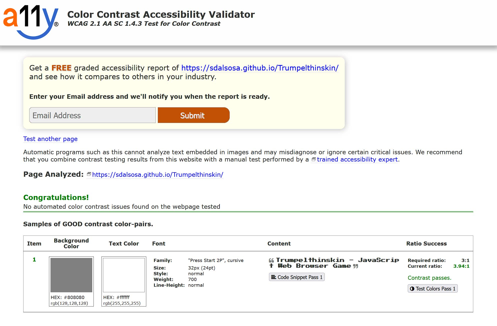

# Trumpelthinkskin JavaScript Game

## Portfolio 2 project as part of the Diploma in Full Stack Software Development by Code Institute.
Trumplethinskin is a satirical game created with JavaScript depicting Donald Trump's attemps to get back to The White House.

# Contents

* [Objective](<#objective>)
* [User Experience UX](<#user-experience-ux>)
    * [Target Audience](<#target-audience>)
    * [User Stories](<#user-stories>)
* [Design](<#design-choices>)
    * [Site Structure](<#site-structure>)
    * [Colour Scheme](<#colour-scheme>)
    * [Typography](<#typography>)
    * [Imagery](<#imagery>)
    * [Wireframes](<#wireframes>)
* [Features](<#features>)
    * [Game Load](<#game-load>)
    * [Trump Sprite](<#trump-sprite>)
    * [Reporter Sprite](<#reporter-sprite>)
    * [Speech Bubble Sprite](<#speech-bubble-sprite>)
    * [Multiple Reporters](<#multiple-reporters>)
    * [Background Image](<#background-image>)
    * [Foreground Image](<#foreground-image>)
    * [Collision Detection](<#collision-detection>)
    * [Win and Lose Detection](<#win-and-lose-detection>)
* [Future Features](<#future-features>)
* [Technologies Used](<#technologies-used>)
* [Testing](<#testing>)
    * [Bugs](<#bugs>)
    * [Unfixed Bugs](<#unfixed-bugs>)
    * [Validator Testing](<#validator-testing>)
    * [Lighthouse Testing](<#lighthouse-testing>)
    * [Color Contrast Testing](<#color-contrast-testing>)
* [Deployment](<#deployment>)  
* [Credits](<#credits>)
    * [Developer Team](<#developer-team>)

# Objective:

To design a clean, intuitive, funny, retro style and fully responsive game in JavaScript for devices with keyboards.

The three main objectives are:

* ## Create a fun game in JavaScript without using any Libraries or Frameworks
    I decided to go with a retro early 90s style game for this project without the use of JavaScript Libraries or Frameworks. I decided to create a game for this project as I always thought this would be something I could never do and wanted to challenge myself.
* ## Control
    The user is able to move the character left and right and fire their "Fake News" speech bubble at reporters to make them disappear so they don't hit the character.
* ## Win and lose Scenarios
    The user is able to win the game by making it to the end of the level without being hit by a reporter. On doing so, they get a message to inform them have won. The user will lost the game if they get hit by a reporter.

[Back to top](<#contents>)

# User Experience (UX):

## Target Audience

* Users that are looking for a fun, satirical, web browser game to play. 

## User Stories

### Visitor Goals

* Easily understand what the website is about.
* Understand what the game is about and how to control the character.
* Play the game and win!

[Back to top](<#contents>)

# Design Choices

## Site Structure

Trumpelthinskin is a simple and clean layout with a canvas and some basic instructions in html.

## Colour Scheme

The colour scheme used for this project was only two colors to maintain a retro style and not take focus from the game itself. [Coolor](https://coolors.co/ffffff-808080)

* White `#FFFFFF`
* Web Grey `#808080`

## Typography

I chose the font **Press Start 2P** for the game as it suited the retro feel.

The fonts were sourced from [Google Fonts](https://fonts.google.com/).

## Imagery

Readme images were screenshot from mentioned sites and wireframes were created in photoshop.

## Wireframes

Wireframe for how the webpage will look.

 Wireframes 

[Back to top](<#contents>)

# Features

Trumpelthinskin is designed as a one page web browser game, making it very clean and logically laid out 
so the user clearly knows what the site is about.

The language is easy to understand and the game is intuitive with a consistent color scheme 
that adds to the style of the retro game.

This is a fully responsive website. 

## Game Load

The game loads automatically when the site is accessed.

## Trump Sprite

The main character in the game is Donald. His sprite consists of 12 images that are used to make the run animation.

## Reporter Sprite

Reporters are one of Trumps biggest fears, they come at him to tell him his ratings are down. Here is an 8 image sprite to make the walking animation

## Speech Bubble Sprite

This is Trumps weapon against the reporters, a "Fake News" speech bubble that he first at them to make them disappear. The sprite consists of 8 images

## Multiple Reporters

An array was created for the reporters and adds to it as they are created. Once they are hit by the speech bubble, they are removed from the array

## Background Image

The background contains a cityscape. This moves at a slower speed than the background which creates a parallax effect and a sense of depth.

## Foreground Image

The foreground contains the ground, trees and The White House. This moves at a faster speed than the background which creates a parallax effect and a sense of depth.

## Collision Detection

The code detects if a speech bubble hits a reporter and makes them disappear. It also detects if a reporter hits trump and ends the game.

## Win and Lose Detection

The code handles a win scenario when Donald makes it to the White House and a lose scenario when he gets hit by a reporter.

[Back to top](<#contents>)

# Future Features

* Sound to go with the game such as a background music track and sound effects
* Add more characters and different scenarios
* Power ups for trump and other characters
* Scoring system and a leader table
* More levels of increasing difficulties

[Back to top](<#contents>)

# Technologies Used

Here are a list of technologies used in this project

- [GitHub](https://github.com/) Used to host website
- [Gitpod](https://www.gitpod.io/) Used as IDE
- [Git](https://git-scm.com/) Version control
- [HTML](https://developer.mozilla.org/en-US/docs/Web/HTML) Used to input the website content
- [CSS](https://developer.mozilla.org/en-US/docs/Learn/Getting_started_with_the_web/CSS_basics) Used to style the website content
- [JavaScript](hhttps://www.javascript.com/) Used to create the game
- [Google Fonts](https://fonts.google.com/) Used to select fonts for the website
- [Google Developer Tools](https://developers.google.com/web/tools/chrome-devtools) Used for testing responsiveness of the website
- [Tiny.jpg](https://tinyjpg.com/) Reduced size of images.
- [Favicon.io](https://favicon.io/) Used to convert the logo to a favicon.
- [AmIResponsive](http://ami.responsivedesign.is/) Used to create responsive image used at the top of the readme
- [Coloors](https://coolors.co/) Used to display the color palette image in the readme.
- [Color Contrast Accessibility Validator](https://color.a11y.com/) Tested color contrast through the website.
- [W3C Markup Validation Service](https://validator.w3.org/) Validated HTML for the website
- [W3C CSS Validation Service](https://jigsaw.w3.org/css-validator/#validate_by_uri) Validated CSS for the website
- [JShint](https://jshint.com/) Used to check JavaScript code for errors
- [Adobe Photoshop CS6](https://www.adobe.com/ie/products/photoshop.html) Used to create and edit images used for the website.

[Back to top](<#contents>)

# Testing 

I have spent many many hours testing this site and had family and friends go through it for me on different devices. 

This led to many issues being identified.

## Game

| TEST | OUTCOME | PASS / FAIL |
|:---:|:---:|:---:|
| Trump Sprite animation | Main character sprite animates correctly | PASS |
| Reporter Sprite animation | CNN Reporter sprite animates correctly | PASS |
| Speech Bubble  | When spacebar is pressed, the main character fires his speech bubble which animates| PASS |
| Movement | When a and d are pressed, the character moves left and right respectively | PASS |
| Background parallax | backgroun and foreground move a different speeds giving a parallax effect | PASS |
| Collision Detection | detect when main character gets hit by reporter and when speech bubbles hit a reporter | PASS |
| Lose Scenario | When main character gets hit by a reporter, a lose message appears | PASS |
| Win Scenario | When main character makes it to the end of the level, a "win" message appears | PASS |

## Bugs

* When spacebar pressed, too many speech bubbles were firing at the same time and the animations overlaped. Resolved by setting an interval between bubbles on spacebar press.

* Character was able to go out of bounds both left and right. Created a distance tracker to make sure character could not go beyond bounds of game. 

## Unfixed Bugs

* Animation speed is reliant on refresh rate of the device that it's used on. 

## Validator Testing 

- HTML
  - No errors were returned when passing through the official W3C html validator 
- CSS
  - No errors were found when passing through the official [(Jigsaw) validator](http://jigsaw.w3.org/css-validator/validator?lang=en&profile=css3svg&uri=https%3A%2F%2Fsdalsosa.github.io%2FTrumpelthinskin%2F&usermedium=all&vextwarning=&warning=1)

## Lighthouse Testing

The website was also put through Lighthouse testing and passed all tests with a green result.

## Color Contrast Testing

The website was also put through colour contrast accessibility validator testing and passed with no contrast issues.

[Back to top](<#contents>)

# Deployment

Deployment was done using GitHub pages. The steps to deploy are as follows: 

  - Open GitHub repository, 
  - Navigate to the Settings tab
  - Click pages link in the left column
  - In the source section drop-down menu, select the Main Branch
  - Click save
  - The page will be automatically refreshed with a link to the deployed website. 

The live link can be found here - https://sdalsosa.github.io/Headshot-Photography/

[Back to top](<#contents>)

# Credits

Trump Win and Lose image was modified from the original image found on Greg Fuzion's [blog](https://gregcfuzion.files.wordpress.com/2017/07/trump.jpg)

favicon image was taken from [nicepng.com](https://www.nicepng.com/ourpic/u2q8a9u2e6e6a9r5_donald-trump-donald-trump-pixel-art/)

Trump sprite was inspired by a gif from the [Haze Trump site](https://www.paulmitchellkelly.com/portfolio/praise-haze-trump)

Reporter sprite was created using [RPG Character Creator](https://store.steampowered.com/app/1154430/RPG_Character_Builder/) on steam

For all things JavaScript, I learned from many hours of tutorials from [Frank's Laboratory](https://www.youtube.com/c/Frankslaboratory)

[Back to top](<#contents>)

## Developer

* Alan Egan - Junior Software Developer at Code Institute

[Back to top](<#contents>)